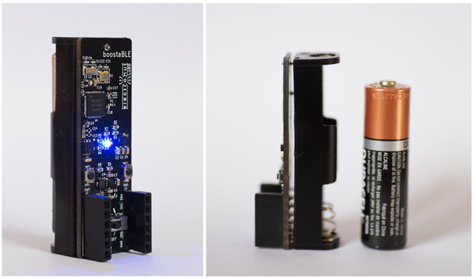

# boostaBLE

boostaBLE is an Open Source nRF52832 BLE development board with 
sensors with a built-in AA battery.

## Specifications

- Nordic nRF52832 BLE SoC with 512k Flash, 64k RAM
- TPS61098 boost converter
- SI7006-A20 Temperature/humidity sensor
- LIS2DH12 Accelerometer
- RGB LED
- Keystone 2460 AA battery holder
- Power switch
- NFC antenna connection
- Two 1 x 6 female headers for GPIOs
- PCB antenna

## Programming

boostaBLE can be programmed using SWD interface. The guide to use nRF52-DK and Bumpy to program boostaBLE are included below:

<h3><a href="#nRF52-DK">Guide: Program boostaBLE with nRF52-DK</a><h3/>

<h3><a href="#Bumpy">Guide: Program boostaBLE with Bumpy</a><h3/>

<h2 name="nRF52-DK"> Guide: Program boostaBLE with nRF52-DK </h2>

### Connections

| nRF52-DK | boostaBLE |
| -------- | --------- |
| VTG | VDD |
| GND | GND |
| SWDIO | DIO |
| SWDCLK | DCLK |

### Steps

* Copy **boostable-test** from *code/* directory to *nRF5_SDK_14.2.0_17b948a\examples\ble_peripheral* directory.

* Open *nRF5_SDK_14.2.0_17b948a\examples\ble_peripheral\boostaBLE-test\boostaBLE\s132\armgcc* in command prompt.

* Run: `make` to compile the code.

* To upload softdevice, run: `make flash_softdevice`

* Upload the application, using `make flash` command.

<h2 name="Bumpy"> Guide: Program boostaBLE with Bumpy </h2>

### Connections

| Bumpy | boostaBLE |
| ----- | --------- |
| 3V3 | VDD |
| GND | GND |
| SWDIO | DIO |
| SWCLK | DCLK |

### Steps

In order to upload BLE applications that are softdevice dependent, you need to generate a merge the softdevice and application hex files. Follow the steps mentioned below to generate a merged hex file.

* Install [nRFGo Studio](https://www.nordicsemi.com/chi/node_176/2.4GHz-RF/nRFgo-Studio) or [nRF5x-Command-Line-Tools-Win32](https://www.nordicsemi.com/eng/nordic/Products/nRF51822/nRF5x-Command-Line-Tools-Win32/33444)

* Copy **boostable-test** from *code/* directory to *nRF5_SDK_14.2.0_17b948a\examples\ble_peripheral* directory.

* Open *nRF5_SDK_14.2.0_17b948a\examples\ble_peripheral\boostaBLE-test\boostaBLE\s132\armgcc* in command prompt.

* Run: **make** to compile the code and generate application hex file.

* Merge softdevice and application, using following command:

`mergehex -m E:\nRF5_SDK_14.2.0_17b948a\components\softdevice\s132\hex\s132_nrf52_5.0.0_softdevice.hex _build\nrf52832_xxaa.hex -o boostable_test_merged.hex` 

* Run: `arm-none-eabi-gdb`

* Connect your Bumpy to PC.

* Find out the COM port assigned to Bumpy using Device Manager.

* Run: `target extended remote //./<COM_Port>` or `tar ext //./<COM_Port>`

* Run: `monitor swdp_scan` or `mon swdp_scan` to scan devices available for debugging. You should see following response:

`Available Targets:
No. Att Driver
 1      Nordic nRF52`
 
* Run: `attach 1` or `att 1` to attach to the target device i.e. Nordic nRF52.

## Buy a boostaBLE!

boostaBLE is available for purchase from our [Tindie store][1]. Please email us at **info@electronut.in** if you have any questions.

[1]: https://www.tindie.com/stores/ElectronutLabs/
